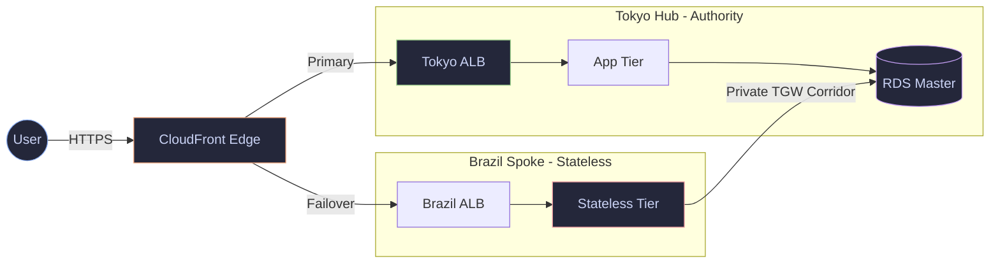

 

&nbsp;

&nbsp;

 

---

### Engineering Philosophy
Building systems that decouple **time** from **money**. Architecting for highly-regulated industries where security is not a checkbox — it’s a prerequisite for existence. My work focuses on **Infrastructure-as-Code**, **Zero-Trust Security**, and **FinOps** discipline to ensure that scale never comes at the cost of stability or profitability.

---

### 🗼 TokyoAPPI 🇯🇵
**The Problem:** Architect a telemedicine platform requiring 99.99% availability while strictly adhering to Japan's APPI data residency laws.

[**Explore Repository**](https://github.com/M-Bash/TokyoAPPI) | [**View Audit Manifest**](https://github.com/M-Bash/TokyoAPPI/blob/main/DELIVERABLES/README.md)

---

### Core

| Compute & Mesh | Infrastructure & Security | AI & Compliance |
| :---: | :---: | :---: |
|    |    |    |

---

### Tracker

  

  

---

### ⚡ Recent Activity
<!--START_SECTION:activity-->
<!-- This section is automatically updated by the profile-activity-worker -->
<!--END_SECTION:activity-->
