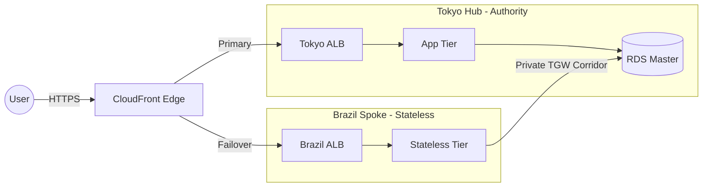

<!-- PART 1: THE HERO HEADER -->
<!-- Dynamic Banner using Capsule Render -->
<!-- Theme: Waving, Dark Mode, Centered, Professional Font -->
<!-- PART 1: THE HERO HEADER -->

  

<!-- PART 2: THE HOOK (FIXED WIDTH & TEXT) -->

  

 

<!-- PART 2: THE "HOOK" (TYPING ANIMATION) -->
<!-- Psychology: This forces the eye to track the movement, increasing 'Time on Page' -->

<!-- PART 3: THE SOCIAL PROOF (BADGES) -->
<!-- Strategy: High contrast, official branding colors, direct CTA -->

  
  &nbsp;
  
  &nbsp;
  

 
 

  <!-- This invisible character forces a clean visual break -->
  &nbsp;

---

### 👨‍💻 Engineering Philosophy

I believe that **hope is not a strategy**. Reliable infrastructure is built on deterministic code, rigorous security controls, and automated verification. I don't just deploy resources; I build platforms that allow teams to ship faster without breaking things.

<table>
  <tr>
    <td width="50%" align="center" style="border: none;">
      <h3>🏛️ Infrastructure as Code</h3>
      
If it isn't in Git, it doesn't exist. I strictly define infrastructure using Terraform to prevent drift and ensure disaster recovery is a <code>terraform apply</code> away.

    </td>
    <td width="50%" align="center" style="border: none;">
      <h3>🛡️ Security by Design</h3>
      
Compliance isn't an afterthought. I bake IAM least-privilege, WAF shielding, and encryption into the pipeline. I build architectures that pass audits by default.

    </td>
  </tr>
</table>

---

### 🛠️ The Arsenal

  <table style="border: none; border-collapse: collapse;">
    <tr>
      <td align="center" width="96" style="border: none;">
        
         <b>Cloud</b>
      </td>
      <td align="center" width="96" style="border: none;">
        
         <b>IaC</b>
      </td>
      <td align="center" width="96" style="border: none;">
        
         <b>Automation</b>
      </td>
      <td align="center" width="96" style="border: none;">
        
         <b>Scripting</b>
      </td>
      <td align="center" width="96" style="border: none;">
        
         <b>CI/CD</b>
      </td>
      <td align="center" width="96" style="border: none;">
        
         <b>Core</b>
      </td>
    </tr>
  </table>

 

<!-- CERTIFICATIONS AREA -->
<!-- Strategy: Use official hex codes. AWS Gold (#FF9900) and HashiCorp Purple (#5C4EE5) -->

  
  

 

### 📊 Engineering Metrics

<!-- 

  

 -->

<!-- This is a custom 'Activity' bar that is more stable -->

  

---

### 🏗️ Featured Architecture Case Studies

#### 📡 TokyoAPPI: Multi-Region Compliance Backbone
> **The Challenge:** Architect a telemedicine platform requiring 99.99% availability while strictly adhering to Japan's APPI data residency laws—preventing PHI (Patient Health Information) from persisting in the failover region (Brazil).

**The Solution:**
*   **Asymmetric Hub-and-Spoke:** Centralized persistence in `ap-northeast-1` with a stateless, compute-only extension in `sa-east-1`.
*   **The Legal Corridor:** Established **Transit Gateway (TGW) Peering** to route cross-region traffic over the AWS private backbone, bypassing the public internet.
*   **Origin Cloaking:** Implemented a "Double-Lock" security posture using **WAFv2** at the edge and **X-Origin-Secret** header handshakes at the ALB.

`Terraform` `Transit Gateway` `CloudFront` `WAFv2` `SSM Bridge`

[**Explore Repository**](https://github.com/M-Bash/TokyoAPPI) | [**View Audit Manifest**](https://github.com/M-Bash/TokyoAPPI/blob/main/DELIVERABLES/README.md)

---

---

### ⚡ Recent Activity
<!-- START_SECTION:activity -->
<!-- This section will be automatically updated by a GitHub Action -->
<!-- END_SECTION:activity -->

  <i>Last updated on: <!-- TIMESTAMP_GOES_HERE --></i>

